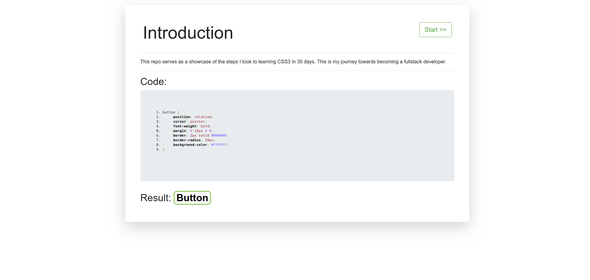

## About

### Brief

This repo demonstrates the lessons I went through while learning CSS in 30 days. The purpose of this is learning to make better designs for my web applications and futher my knowledge in UX/UI design. My goal is to work towards being a fullstack developer and this is my journey towards that goal

### Setup

Simply:
- Clone the repo 

```
git clone https://github.com/PeterKitonga/vanillacsslearning.git
```
- Navigate to the project and click on the `index.html` file of a lesson

### Illustration


### Tutorial
Visit [Code College](https://codecollege.ca) for the tutorial